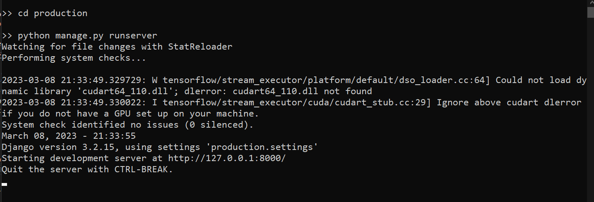

# Female Pregnancy Outcome

## Project Objectives

This project aims to predict the outcome of pregnancy in a woman using the AHS dataset and the decision tree algorithm. The objective is to develop a model that can accurately predict the risk of adverse pregnancy outcomes, such as preterm birth, low birth weight, and gestational diabetes. The decision tree algorithm will be used to build a classification model that can identify the most important predictors of adverse pregnancy outcomes. The model will be trained and evaluated using historical data from the AHS dataset.

## Project Structure
- `assets/` - Holds plot images obtained during the study.
- `datasets/` - Holds the dataset used in the study.
- `production/` - Holds Django files that enables prediction in a live environment
- `production/artifcats/` - Holds contents of the compiled model.
- `production/templates` - Holds html files used in the web environment.
- `production/static` - Holds CSS files used in the web environment.
- `production/RequestHandler` - Holds files that interface with the prediction functions.

### Installing dependencies
The following packages are required to run the notebook:

- pandas
- matplotlib
- sklearn# Jupyter Notebook Documentation
- keras

You can install all of the required packages by running the following command in your terminal:

```sh
pip install -r requirements.txt
```

## Introduction
This project's notebook contains a series of cells that perform various tasks related to predicting female pregnancy outcomes based on the AHS Woman dataset. The purpose of this document is to provide an overview of each cell and explain the process that happens in each cell and why it is important.

## Cell 1: Data Loading and Selection
The first cell in this notebook is responsible for loading the AHS Woman dataset into memory and selecting columns relevant to the prediction task. This step is important to ensure that we are working with the right subset of data that will enable us to make accurate predictions.

## Cell 2: Data Preprocessing
The second cell in this notebook is where we preprocess the data. This includes tasks such as dropping null cells, splitting the data into features and target, and encoding categorical features. These steps are important to ensure that the data is in the correct format for the machine learning models we will be using later in the analysis.

## Cell 3: Data Splitting and Model Training
The third cell in this notebook is where we split the preprocessed data into training and testing sets, and train a Decision Tree model on the training set. This step is important to ensure that we can evaluate the performance of the model on an unseen dataset, which will provide us with a better understanding of how well the model will generalize to new data.

## Cell 4: Model Evaluation
The fourth cell in this notebook is where we evaluate the performance of the Decision Tree model on the test set. This includes tasks such as predicting the target variable using the trained model, calculating accuracy, generating a confusion matrix, and printing a classification report. These steps are important to ensure that we have a thorough understanding of how well the model is performing, and to identify any areas for improvement.

## Collecting metrics
To further evaluate the performance of the model, we collected several metrics to measure its accuracy and performance.

Firstly, we used the accuracy score metric to measure the percentage of correctly predicted outcomes. This metric is essential to measure the overall performance of the model and helps to determine the accuracy of the model in making predictions. In this study, we obtained an accuracy score of 98%, which indicates that the model is highly accurate in predicting female pregnancy outcomes.

We also generated a confusion matrix to measure the number of true positives, false positives, true negatives, and false negatives in the model's predictions. This metric provides more detailed information on the performance of the model, particularly on how often it predicts each outcome correctly or incorrectly. The confusion matrix is important because it can help to identify the strengths and weaknesses of the model and can be used to optimize it further.

## Making Real-time Predictions
To enable real-time predictions, the model artifacts are served in an environment powered by Django and Jinja's Template engine. To deploy the web environment locally, switch to `production` folder and start the web server:

```sh
cd production
python manage.py runserver
```
Server Log:



In a browser window, open the specified address (http://127.0.0.1:8000), specify the model to be used for prediction and passing the value(s) to be predicted for.

## Conclusion
In summary, this project contains a series of cells that perform various tasks related to predicting female pregnancy outcomes based on the AHS Woman dataset. Each cell has been documented to provide an overview of the process that happens in each cell and why it is important. By following these steps, we can ensure that our analysis is accurate, reliable, and effective. Additionally, this notebook provides a thorough evaluation of the machine learning model's performance on the test set, which can be used to improve the model's performance in future iterations.
